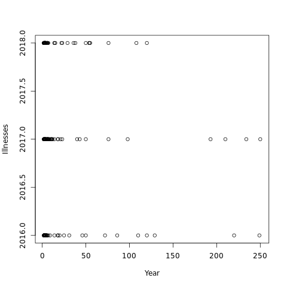

```{r, setup, include=FALSE}
knitr::opts_chunk$set(
  echo = FALSE)
```

```{r, load-packages}
install.packages(c("openxlsx","haven","gtools"))
library(openxlsx)
library(haven)
library(gtools)
```

```{r, load-data}
my_data <- read.xlsx(xlsxFile='../data/NORS.xlsx')
```

## Review Data

My data has `r nrow(my_data)` rows and `r ncol(my_data)` columns.

## Data Visualization

Some summary plots are shown below 




